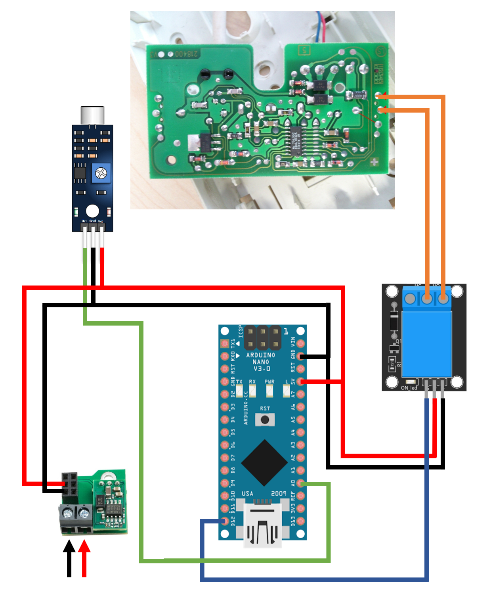
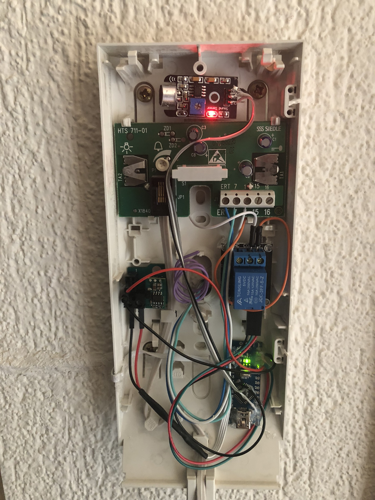

# magicdooropener
An arduino project to open your door using the bell.

## Why use the magic door opener?
I live in an appartmentbuilding, where the maindoor is always closed.  
When I return from groceryshopping it's often too complicated to search the keys, while holding the bags.  
Maybe you know the struggle to put down all the groceries, search for the keys, open the door, kick the door constantly open while grabbing the bags and stepping in.  
  
This pissed me off so hard , that I chose to hack my doorbell. The whole project cost me around 20$ (and some precious precious time :))

## How to open the door
It depends what secret code you'll choose. 
Then simply ring your secret bellcode and the door will open shortly after.

## Configuration
If your doorbell has a special melody to it, the program will not work.
Since the program is detecting the bell acoustically you'll have to adjust the threshold (aRing) according to the volume of your doorbell.

### Setting the secret ringcode
Simply modify the array (secretCode) with the time (ms) between the rings.  
Currently it's designed to open the door after 4 rings -> 3 pauses of 100ms each.

## Hardware
- Arduino Nano (https://www.aliexpress.com/item/Nano-Mini-USB-With-the-bootloader-compatible-for-arduino-Nano-V3-3-0-controller-CH340-USB/32834092184.html)
- Relay KY-019 (https://www.aliexpress.com/item/Free-shipping-1-Channel-5V-Relay-Module-for-arduino-1-Channel-realy-KY-019-For-PIC/32562505363.html)
- Arduino Analog Sound Sensor Module High Sensitivity Microphone (https://www.aliexpress.com/item/High-sensitivity-microphone-sensor-module-electronic-building-sound-sensor-module-for-Arduino/1462781648.html)
- Power Converter (https://www.piborg.org/power-1137/battborg)
- Any 5 to 32V Powersupply (when using the power converter, 5V without the converter)

## Installation
I first tried to grab the power directly from the **Siedle HTS-711 01**. A voltage of 18-24V could be measured betweet the connectorpins 7 and 1\.  
With the power converter it was no problem to grab the power there. The issue with this soulution was: due to the additional power consumption of the components it was not possible to open the door or speak through the telephone anymore.  
What I ended up with, is an external power supply. I recycled an old 7V power supply which was laying around.  
  
To detect the ringing was a bit more tricky. The phones voltage between the connectorpins 7 and 1 dropped when ringing from 24V to 18V (may differ in your installation). I built a simple voltage divider and read the output via Analog IN.  
I altered the program to detect the voltagedrop as ringing. This method worked detected a ring, but as in the power example before the door wouldn't open and we couldn't talk over the phone anymore.
In the end I decided to add an analog microphone and listen acoustically to the ringing.

